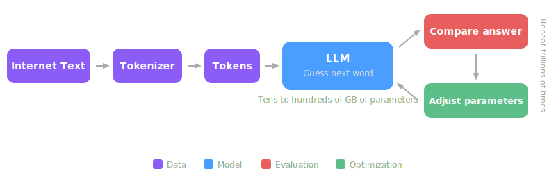

# CLAUDE.md

This file provides guidance to Claude Code (claude.ai/code) when working with code in this repository.

## Project Overview

llm.johnsonlee.io is a kid-friendly website for learning about Large Language Models. Content is presented in a **slides** format, making complex LLM concepts approachable for children. The slide content is derived from `llm-must-read-top-100-papers.md`, a curated list of 100 essential LLM research papers.

## Architecture

- **Presentation style**: Slide-based (swipeable/navigable slides)
- **Content source**: `llm-must-read-top-100-papers.md` — 100 papers organized into 16 topic categories, each with arXiv/PDF links, publication year, and a one-line summary
- **Hosting**: GitHub Pages at `llm.johnsonlee.io` (configured via `CNAME`)
- **Target audience**: Children — language and visuals should be simple and engaging

## Content Structure

The 16 topic categories in order: Transformer Foundations, The GPT Lineage, Scaling Laws & Training Theory, Open-Source LLM Milestones, Efficient Attention & Architecture, Alignment & Safety, Prompting & Reasoning, Parameter-Efficient Fine-Tuning, RAG, Agents & Tool Use, Code Generation, Multimodal Models, Long Context, Reasoning Models, Quantization & Inference, Data Engineering & Evaluation. Each category contains 5-10 papers in a table format with columns: #, Paper (linked), Year, Key Takeaway. A suggested tiered reading order (Tier 1/2/3) follows.

## Content Editing Guidelines

- Paper entries use Markdown table format: `| # | [Title](url) | Year | One-line takeaway |`
- Keep summaries concise and focused on the key contribution
- Maintain sequential numbering across all categories (1-100)

## i18n

- English slides live in `src/en/`, Chinese slides in `src/zh/`
- `index.html` reads `?lang=` query parameter (default `en`) and dynamically sets `data-markdown` paths
- A language toggle button in the top-right corner switches between `?lang=en` and `?lang=zh`

## Slide Layout Rules

There are three types of slides, each with different layout and markdown conventions:

1. **Cover / Title page** — Centered layout. Uses `<!-- .slide: class="center" -->` directive. Contains `# H1` title, subtitle, author info. Example: `cover.md`.

2. **Chapter title page** — Centered layout. Uses `<!-- .slide: class="center" -->` directive. Contains `## H2` chapter number and name, plus an italic tagline. This is the first slide in each chapter file. Example:
   ```
   <!-- .slide: class="center" -->

   ## 1. Transformer Foundations

   *How does a computer understand language?*
   ```

3. **Title + Content page** — Top-aligned flex layout (default, no directive needed). Contains `## H2` title followed by body content (bullet points, blockquotes, tables, etc.). Content should fit on one screen — if it overflows, split into multiple slides. Example:
   ```
   ## Attention: Look at Everything at Once

   - For each word, the LLM asks: *"Which other words are important to me?"*
   - All words are processed **in parallel**, not one by one

   > [Attention Is All You Need](https://arxiv.org/abs/1706.03762) (2017)
   ```

4. **Title + Image page** — Title top-left aligned, image centered in the remaining space. Do NOT use `<!-- .slide: class="center" -->` (that would center everything including the title). The default top-aligned layout naturally places the title at the top-left; the image is centered via Markdown `` which renders as a block-level ``. Example:
   ```
   ## How Is an LLM Made?

   
   ```

Slides within a chapter are separated by `----` (horizontal rule). The `<!-- .slide: class="center" -->` directive must appear as the very first line of the slide (immediately after `----`).

## Quotation Mark Rules

- **Chinese slides (`src/zh/`)**: Always use `“”` as the quotation mark pair. Never use ASCII straight quotes `"` in Chinese content. HTML attributes (e.g., `class="center"`) remain unchanged.
- **English slides (`src/en/`)**: Use ASCII straight quotes `"`.

## Terminology Rule

- **English slides**: Use "LLM" (not "computer" or "model") when referring to what a large language model does — understanding, learning, predicting, generating, etc. "Computer" is only acceptable when referring to hardware (e.g., "powerful computers", "run on your computer") or general concepts (e.g., "computer program", "computer science").
- **Chinese slides**: Use "大语言模型" (not "模型" or "计算机") when referring to what an LLM does. "计算机" is only acceptable for hardware or general concepts (e.g., "超级计算机", "计算机程序", "计算机科学").

## Slide Writing Rules

- **Match register to context.** Use casual, conversational language for explanations and analogies (e.g., "猜下一个词", "没地方坐了"). Use proper technical terms for concepts and definitions (e.g., "涌现能力", "分词器", not informal substitutes). Don't use casual language where a technical term is expected, and don't use stiff/formal language where a simple explanation is needed.
- **One idea per slide.** If a slide's content overflows the screen, split it into multiple slides. Each slide should focus on a single point.
- **Introduce concepts before using them.** Never use a term (e.g., "tokenizer", "token") without first explaining what it is. New concepts must be introduced on the same slide or an earlier slide before being referenced.

## SVG Diagram Rules

- **File location**: Language-specific images go in `src/{lang}/images/` (e.g., `src/zh/images/llm-training-flow.svg`), not in a shared `src/images/` directory. Both language versions use the same filename, text content is translated.
- **Reference in Markdown**: Use Markdown image syntax ``, not HTML `` tags.
- **Color scheme**: Use distinct colors for different semantic categories. Avoid `#e7ad52` (conflicts with the language toggle button). Current palette:
  - `#8b5cf6` (purple) — data nodes
  - `#4a9eff` (blue) — model
  - `#e85d5d` (red) — evaluation
  - `#5dbe8a` (green) — optimization
- **Text on colored backgrounds**: Use `#fff` for primary text and `#ddd` for secondary text on colored rectangles. Never use dark text (`#222`, `#444`) on colored backgrounds.
- **Arrows**: Use SVG `<marker>` with `markerUnits="userSpaceOnUse"`, size 10×8, `refX=6 refY=4`, path `M0,0 L10,4 L0,8 Z`. This prevents the line stroke from poking through the arrowhead tip.
- **Arrow spacing**: Leave 8px gap between arrow start/end and the adjacent box edge. Lines must not touch boxes directly.
- **Legend**: Place the legend below the flow diagram, horizontally centered. Leave adequate whitespace (≥60px) between the diagram and the legend.

## CJK Bold Parsing Rule

- The `marked` Markdown parser used by Reveal.js does not correctly parse `**bold**` when the closing `**` is immediately followed by a CJK character or fullwidth punctuation (U+3000–U+303F, U+FF00–U+FFEF, U+2000–U+206F, U+4E00–U+9FFF).
- **Fix**: Always insert a space between the closing `**` and any adjacent CJK character or fullwidth punctuation mark. Example: `**方向** （` instead of `**方向**（`.
